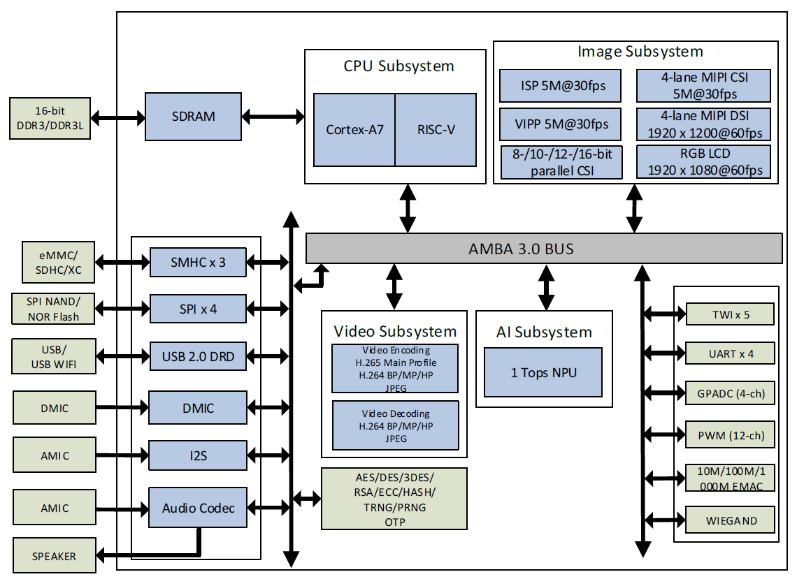

# Project Yosemite

Small Heterogeneous & AI Powered Computing Core

* V853 ARM A7 + RISC-V E907 + 1T NPU 
* UP to 1GiB DDR3 and 128GiB EMMC 
* Built-in MIC 
* Raspberry Pi Camera Connector  
* 4 lane MIPI-CSI 
* 4 lane MIPI-DSI up to 1920x1200 
* Built-in USB to UART Support RV and ARM
* Built-in XR829 Wi-Fi BT 
* Raspberry Pi A Size and Pinouts

Verified: 
* SPI
* IIC
* NPU
* WiFi
* BT
* PMU
* TF Card
* UART to USB
* MIPI DSI
* MIPI CSI

## About Allwinner V853

V853 is a new generation of high-performance and low-power processor SoC targeted for the field of intelligent vision. It can be widely used in intellectually upgraded industries such as intelligent door lock, intelligent attendance and access control, webcam, tachograph, and intelligent desk lamp.
V853 integrates the single Cortex-A7 core and RISC-V core. It is also designed with a new generation of high-performance ISP image processor and Allwinner Smart video engine with maximum 5M@25fps H.265/H.264 encoding and 5M@25fps H.264 decoding to achieve professional picture effect. It has built-in NPU with maximum 1T computing power and supports INT8/INT16 hybrid operation and typical network models such as TensorFlow/MXNet/PyTorch/Caffe. V853 has advanced 22nm technics to support product miniaturization design. It also supports various special video input and output interfaces such as 1*4-lane MIPI/DVP/MIPI-DSI/RGB to meet the needs of all AI visual products. V853 supports 16-bit DDR3/DDR3L to meet the requirements of various products on high bandwidth.

